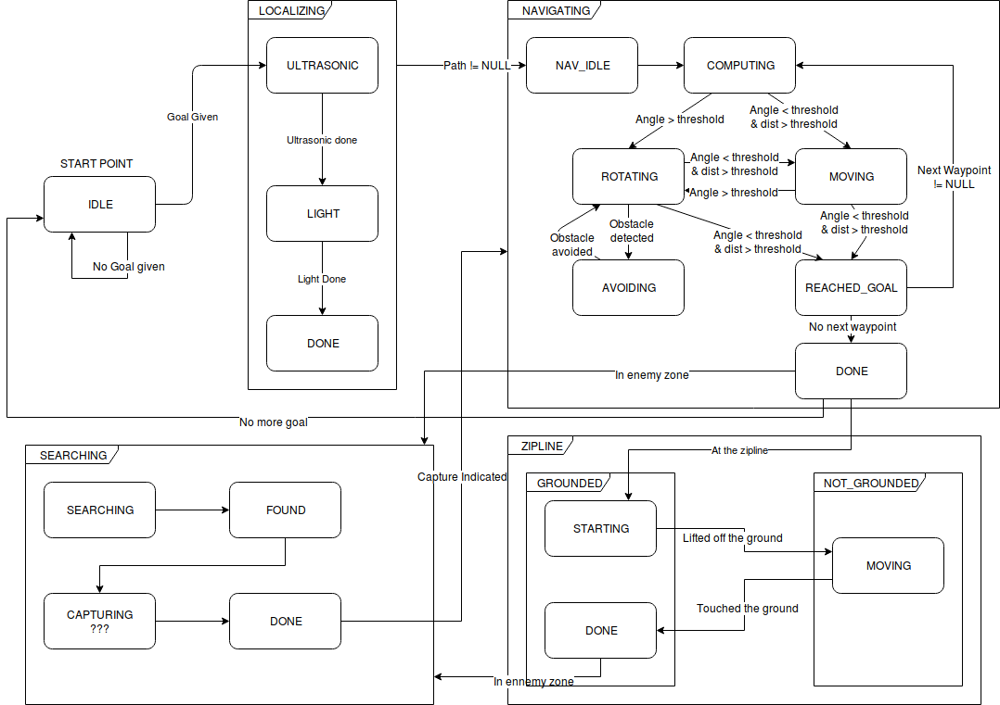
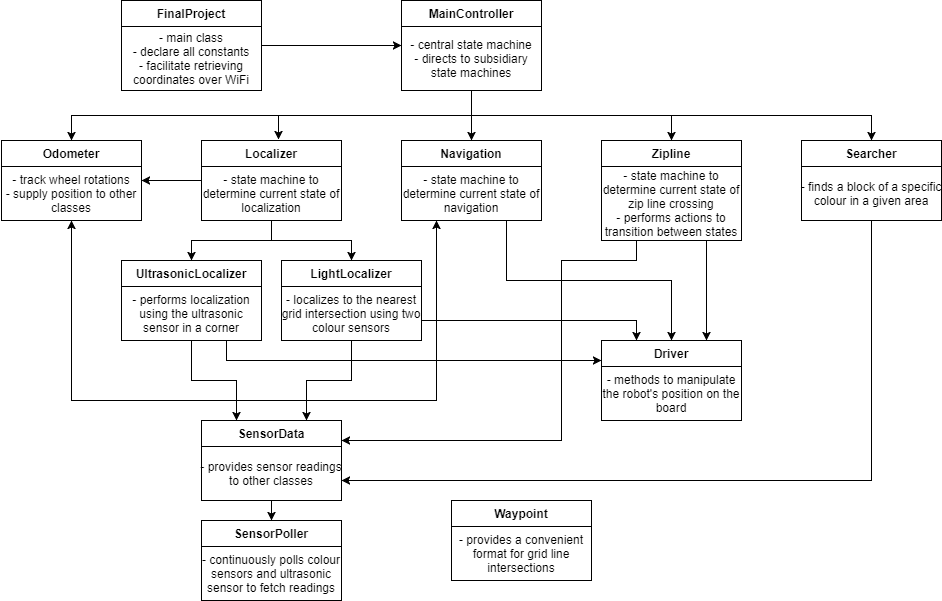

## Software Design

**Project:** ECSE 211 Final Project  
**Task:** Software Design Planning  
**Document Version:** 1.0  
**Date:** 18/10/2017  
**Author:** Justin Tremblay  
**Edit History:**  
[18/10/2017] Justin Tremblay: First version of the document, added state machine and class diagrams.  

### State Machine

The robot is going to be controlled by a state machine that handles taking the descisions depending on the robot's inputs and its current goal. It is inspired from the GOAP (Goal Oriented Action Planning) system which is used in the video game industry to control artificial intelligence of non-playable characters.

[More info on GOAP](http://alumni.media.mit.edu/~jorkin/goap.html)



*NOTE: the CAPTURING state is still a work in progress.*

**TODO:** ZIPLINE should go to localization after finishing.

Each major system is implemented as a thread that executes when the controller calls its startActivity() method (e.g: startLocalization() in Localizer). The controller then waits for the `done` boolean to be set to true to continue its execution, reducing the number of active threads.

**Example of state machine implementation:**

```java
  /**
   * run() method in Controller.java
   * It handles the main control of the robot, delegating tasks to other systems.
   * cur_state is an enum value corresponding to the system's current state.
   */
  public void run() {
    while (true) {
      switch (cur_state) {
        case IDLE:
          cur_state = process_idle();
          break;
        case LOCALIZING:
          cur_state = process_localizing();
          break;
        case NAVIGATING:
          cur_state = process_navigating();
          break;
        case SEARCHING:
          cur_state = process_searching();
          break;
        case ZIPLINE:
          cur_state = process_zipline();
          break;
        default: // The default case isn't really needed here.
          break;
      }

      try {
        Thread.sleep(20);
      } catch (Exception e) {
        // ...
      }
    }
  }
```

This pattern is used in every system. At every iteration, it runs the `process_state()` method corresponding to the current state of the system. This method handles the required actions and returns a new (or the same) state depending on various paramters and conditions.

### Model Diagram

Here is the class diagram of the software architecture.



*NOTE: the server that transmits the game data is currently missing from the diagram*

#### DPMProject
*NOTE: name is subject to change*

* Contains the main method of the program and groups all the constants in one place for easy tuning.

#### Controller

* Main control thread. It delegates control to other systems depending on its current state.

#### Odometer

* Keeps track of the robot's position and orientation on the playing field. It uses the motors' tachometers and simple mathematics to determine displacement. It continuously runs in its own thread.

#### Localizer, UtlrasonicLocalizer and LightLocalizer

* Handles determining the orientation and position of the robot at the start of the game and when the robot comes off the zipline. It is divided in two parts:
    * Ultrasonic Localizer:
        * Uses the ultrasonic sensor and two walls to determine the orientation of the robot, the positive x-axis being 0 degrees.
    * Light Localizer:
        * Uses the color sensor and the assumption that the robot is always rotating in the same direction to determine the robot's position on the grid.

#### Navigation

* Handles navigating the robot through a set of waypoints on the grid as well as avoiding obstacles when they are encountered.

#### Zipline

* Handles moving the robot on the zipline.

#### Searcher

* Works alongside the navigator to seek the "flag" and identify it. Indicates capture when successfully identifying the "flag".

#### Driver

* Handles moving the robot. It is used in every system that requires the robot to move somewhere.

#### UltrasonicPoller and ColorPoller

* They are used by most systems for various purposes. They handle collecting samples and sending them to the right system for processing.
